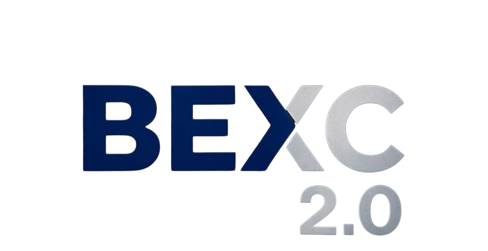
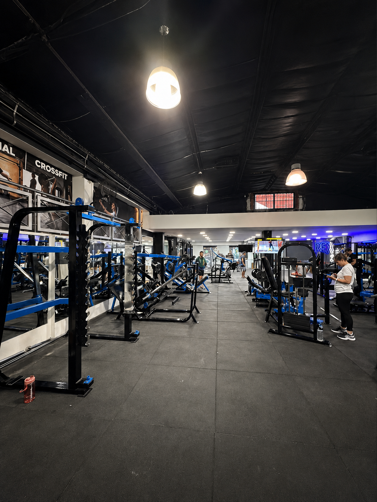
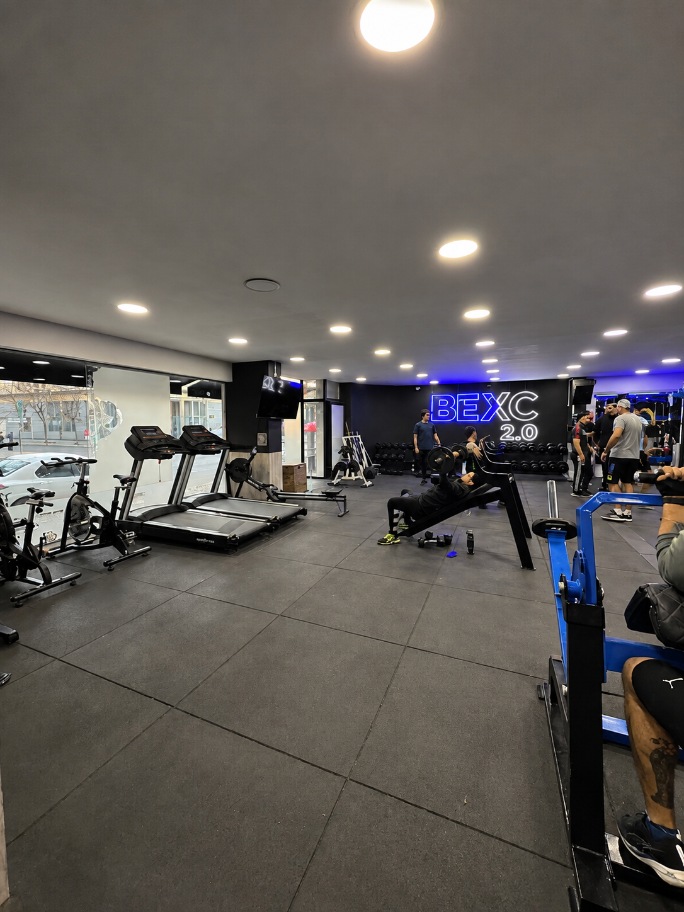
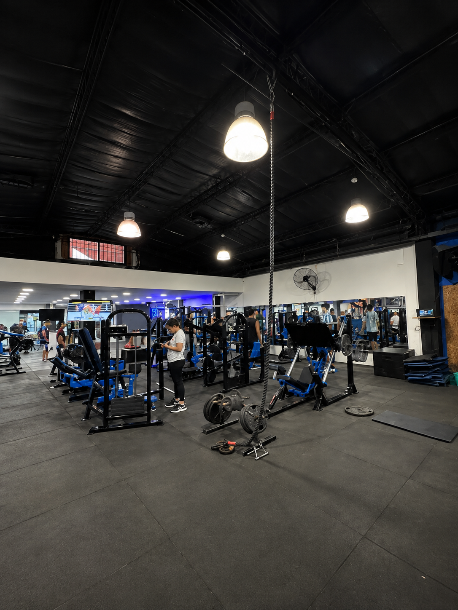
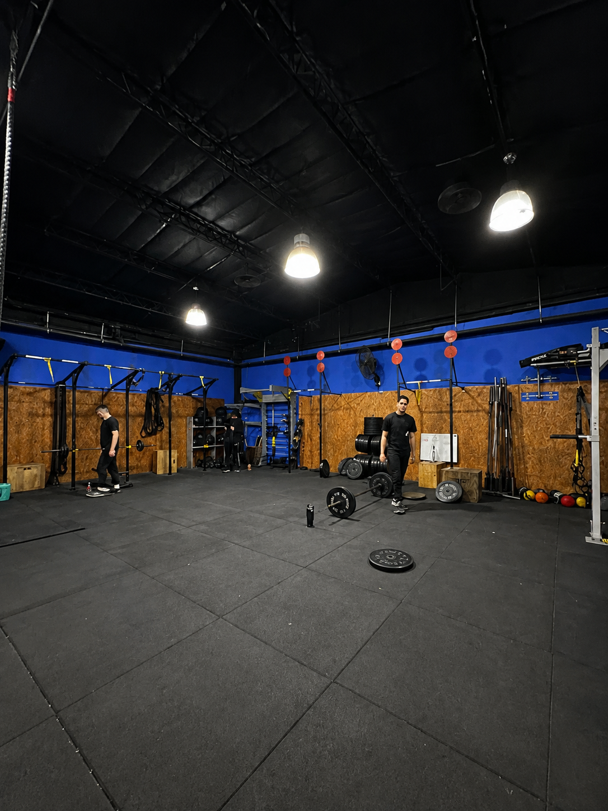
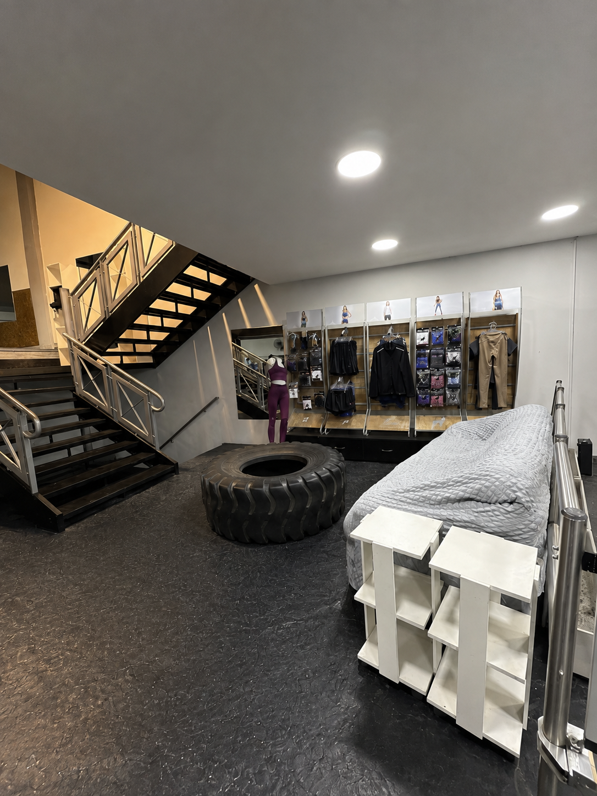
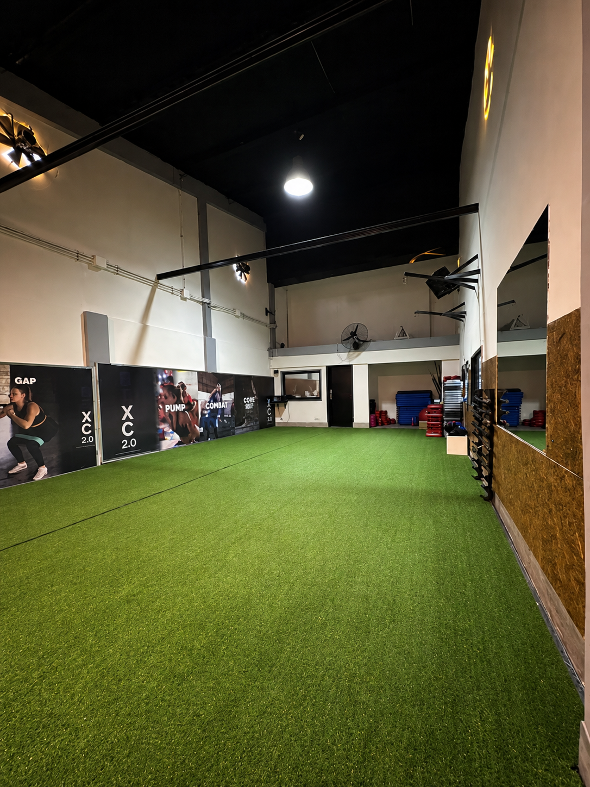

  

  # BEXC 2.0 — CENTRO DE ACONDICIONAMIENTO FÍSICO
  ### *Plataforma Web Oficial • Sede Hurlingham, Buenos Aires*

  
  
  
  
  

  ---

## 🏋️‍♂️ Sobre BEXC 2.0 Gym

**BEXC 2.0** es el centro de acondicionamiento físico y musculación más avanzado y completo de Hurlingham. Nuestra plataforma web ofrece una experiencia digital moderna, dinámica e intuitiva orientada a la conversión de nuevos socios, facilitando la consulta de horarios, evaluación de salud y reserva de pases libres.

---

## ✨ Características y Funcionalidades Destacadas

- ⚡ **Experiencia Hero Interactiva**: Diseño de alto impacto visual con llamada a la acción instantánea para reclamar pase libre.
- 📱 **Rutinas Digitales por Código QR**: Sistema integrado en sala para acceder a guías de ejercicios y técnicas en video.
- 🩺 **Gabinete de Quiropraxia y Nutrición**: Información sobre servicios exclusivos incluidos en la membresía.
- 📅 **Horarios Interactivos de Clases**: Filtro semanal dinámico por días (Lunes a Sábado) para clases de Spinning, CrossFit, Body Pump, GAP, TRX y Funcional.
- 🧮 **Calculadora de IMC y Recomendación Deportiva**: Herramienta interactiva que calcula el índice de masa corporal y sugiere las mejores disciplinas del gimnasio.
- 💳 **Tarjetas de Planes y Membresías**: Presentación clara de precios en efectivo, pagos digitales y packs familiares.
- 🖼️ **Galería Fotográfica con Lightbox**: Exploración inmersiva a pantalla completa con navegación por teclado y transiciones suaves.
- 🗺️ **Módulo de Ubicación & Google Maps**: Vista de mapa interactivo con dirección exacta en Hurlingham y acceso a Google Maps.
- 💬 **Integración Directa con WhatsApp**: Formulario modal fluido con pase directo a WhatsApp oficial.

---

## 🖼️ Galería de Instalaciones y Experiencia BEXC

  ### 📍 Instalaciones Principales (Bloque 2x2)

  <table>
    <tr>
      <td width="50%">
        
         
        <b>01. Sala Principal de Musculación</b>
      </td>
      <td width="50%">
        
         
        <b>02. Equipamiento de Fuerza & Cardio</b>
      </td>
    </tr>
    <tr>
      <td width="50%">
        
         
        <b>03. Área de Cintas & Cardio</b>
      </td>
      <td width="50%">
        
         
        <b>04. Zona CrossFit & Funcional</b>
      </td>
    </tr>
  </table>

   

  ### ⚡ Áreas Especiales (Bloque 2x1)

  <table>
    <tr>
      <td width="50%">
        
         
        <b>05. Sector de Peso Libre & Mancuernas</b>
      </td>
      <td width="50%">
        
         
        <b>06. Box Funcional & Clases Grupales</b>
      </td>
    </tr>
  </table>

   

  ### 🔥 Atletas & Comunidad BEXC (Formato Destacado)

  <table>
    <tr>
      <td width="100%" align="center">
        
         
        <b>07. Atletas & Filosofía de Entrenamiento BEXC 2.0</b>
      </td>
    </tr>
  </table>

---

## 🎨 Diseño & Micro-interacciones (GSAP ScrollTrigger)

El proyecto cuenta con un sistema de animación de alto rendimiento desarrollado con **GSAP (GreenSock Animation Platform)**:

- 🎬 **Scroll Reveal Orgánico**: Revelado sutil de títulos, tarjetas y elementos visuales al desplazarse.
- 🔢 **Contadores Animados**: Animación fluida de estadísticas (*+500 Socios Activos*, *+9 Disciplinas*).
- 🧩 **Acordeón Inteligente en FAQ**: Transición suave de expansión/colapso con dimensiones animadas por CSS Grid.
- 🪟 **Modales & Lightbox Fluidos**: Efectos de desvanecimiento y desenfoque óptico en ventanas flotantes.

---

  ### 💙 Desarrollado por **WaveFrame Studio**
  *Creamos experiencias digitales modernas, rápidas e inolvidables.*

  🌐 **Web**: [https://waveframe.com.ar/](https://waveframe.com.ar/)

  ---
  © BEXC 2.0 Gym. Todos los derechos reservados.

